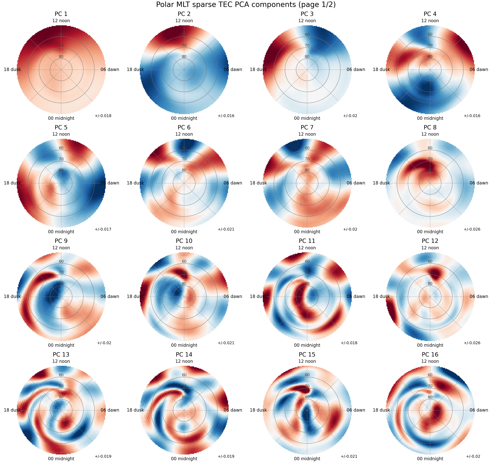
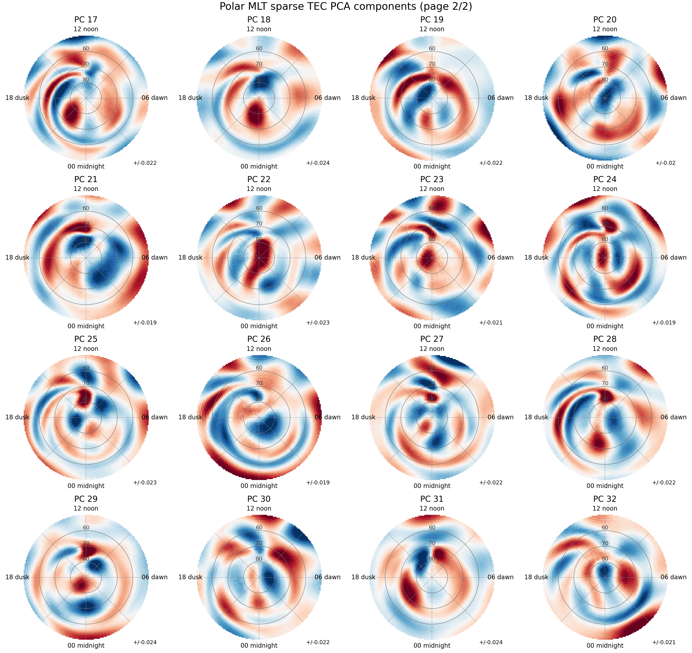

# HEIMDALL polar MLT TEC PCA

Authorship: Noah Nielsen, Juha Vierinen.

This repository contains tools for studying large-scale VTEC variability using sparse principal component analysis. The current workflow projects raw latitude/longitude VTEC maps onto a fixed northern magnetic-latitude / magnetic-local-time grid before training the PCA. The polar grid is oriented with 12 MLT/noon at the top, 18 MLT/dusk at the left, 06 MLT/dawn at the right, and 00 MLT/midnight at the bottom.

The project can be run either by running `__main__.py` or by running the `HEIMDALL` folder as a project. Control flags for the legacy workflow can be set in the `__main__.py` main function.

The PCA training is performed directly from the original HDF5 VTEC files. For each selected frame, the code uses `apexpy` to convert geographic coordinates to quasi-dipole magnetic latitude and MLT, grids the samples onto a 128 x 128 northern polar projection down to 50 degrees magnetic latitude, averages multiple samples falling in the same pixel, and leaves unobserved pixels as `NaN`. Sparse PCA then treats finite pixels as observed and missing pixels as zero-weight samples. A projection-area weighting map is applied so the polar projection does not overemphasize the outer part of the disk.

The latest run used all 208800 VTEC frames and trained 32 sparse principal vectors. The resulting principal vectors are shown below.





## Main Scripts

- `sparse_pca_polar_mlt_on_the_fly.py` trains sparse PCA from raw VTEC HDF5 files using on-the-fly Apex/QD/MLT projection.
- `build_polar_vtec_cube.py` contains the shared polar projection and weighting utilities, and can also build a compressed projected HDF5 cube if needed.
- `plot_polar_mlt_components.py` plots the polar MLT PCA vectors as paged grids.
- `principal_component_analysis.py` contains the sparse weighted alternating-least-squares PCA implementation.

Example full-data training command:

```sh
python sparse_pca_polar_mlt_on_the_fly.py \
  --input-dir /data/nonie/tec_data \
  --output-dir /home/juha/heimdall_polar_mlt_sparse_pca_32_allframes \
  --pixels 128 \
  --min-latitude 50 \
  --components 32 \
  --iterations 8 \
  --sample-frames 208800 \
  --init-sample-columns 8192 \
  --projection-jobs 50 \
  --als-jobs 50 \
  --dtype float32
```

Example plotting command:

```sh
python plot_polar_mlt_components.py \
  --results-dir results/polar_mlt_sparse_pca_32_allframes \
  --output-prefix figures/polar_mlt_sparse_pca_32_allframes \
  --n-components 32 \
  --rows 4 \
  --cols 4
```
